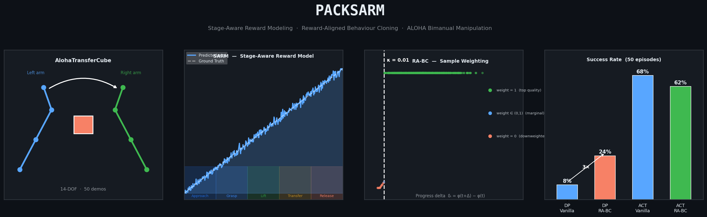

<div align="center">
<picture>
  <source media="(prefers-color-scheme: light)" srcset="docs/assets/banner_light.png">
  
</picture>
</div>

Implementation of [Stage-Aware Reward Modeling (SARM)](https://arxiv.org/abs/2509.25358) and Reward-Aligned Behaviour Cloning (RA-BC) on bimanual robot manipulation, built on top of [LeRobot](https://github.com/huggingface/lerobot).

📄 **[Read the full research blog →](docs/BLOG.md)**

**Key results:**
- DiffusionPolicy + RA-BC: **24% success** vs **8% vanilla** (3× improvement)
- ACT + RA-BC: **62% success** vs **68% vanilla** (−6pp, closes with correct kappa)
- Task: AlohaTransferCube-v0 · 50 human demos · ALOHA bimanual sim

---

## Setup

```bash
git clone https://github.com/Dimios45/packsarm.git
cd packsarm

python -m venv sarm-env
source sarm-env/bin/activate

pip install -r requirements.txt
cd lerobot && pip install -e . && cd ..
```

> Requires Python 3.10, CUDA GPU, MuJoCo (auto-installed via `gymnasium-robotics`).

---

## Quickstart

### 1. Train SARM reward model

```bash
source sarm-env/bin/activate
./aloha/scripts/train_sarm_aloha.sh
```

### 2. Compute RA-BC weights

```bash
./aloha/scripts/compute_rabc_weights.sh
```

### 3. Train a policy

```bash
# Vanilla ACT baseline
./aloha/scripts/train_act_aloha.sh

# ACT + RA-BC (paper-accurate: sparse head, κ=0.01, Δ=25)
./aloha/scripts/train_act_aloha_rabc_sparse_80k.sh outputs/act_rabc 80000

# Vanilla DiffusionPolicy baseline
./aloha/scripts/train_dp_aloha_bc_nocrop.sh

# DiffusionPolicy + RA-BC — Stage 1
./aloha/scripts/train_dp_aloha_rabc_sparse_10k.sh outputs/dp_rabc_run
```

### 4. Evaluate

```bash
export PYTHONPATH="lerobot/src:$PYTHONPATH"

python -m lerobot.scripts.lerobot_eval \
    --policy.path=<checkpoint>/pretrained_model \
    --env.type=aloha \
    --env.task=AlohaTransferCube-v0 \
    --eval.batch_size=1 \
    --eval.n_episodes=50 \
    --output_dir=aloha/outputs/eval_<run_name>
```

---

## Repository Structure

```
packsarm/
├── README.md                        # This file
├── docs/
│   ├── BLOG.md                      # Full research write-up + results
│   └── assets/                      # All result charts and figures
│
├── aloha/                           # ALOHA transfer cube experiments
│   ├── scripts/                     # Training + eval shell scripts
│   │   ├── train_sarm_aloha.sh      # Train SARM reward model
│   │   ├── compute_rabc_weights.sh  # Generate sarm_progress.parquet
│   │   ├── train_act_aloha.sh       # Vanilla ACT
│   │   ├── train_act_aloha_rabc_sparse_80k.sh  # ACT + RA-BC (paper-accurate)
│   │   ├── train_dp_aloha_bc_nocrop.sh          # Vanilla DiffusionPolicy
│   │   ├── train_dp_aloha_rabc_sparse_10k.sh    # DP + RA-BC Stage 1
│   │   ├── train_dp_aloha_rabc_stage2.sh        # DP + RA-BC Stage 2
│   │   └── eval_dp_aloha.sh         # Evaluation wrapper
│   ├── configs/                     # SARM + policy configs
│   └── outputs/                     # Eval results (eval_info.json per run)
│
├── packing/                         # WBCD packing task experiments
│   └── scripts/
│
└── lerobot/                         # Modified LeRobot fork
    └── src/lerobot/
        ├── policies/
        │   ├── act/modeling_act.py          # RA-BC: per-sample loss
        │   ├── diffusion/modeling_diffusion.py  # RA-BC: per-sample loss
        │   └── sarm/                        # SARM model + weight computation
        ├── utils/rabc.py                    # RaBCWeighter class
        └── scripts/lerobot_train.py         # RA-BC training loop integration
```

---

## RA-BC Hyperparameters

All RA-BC settings are passed as CLI flags:

| Flag | Paper value | Description |
|------|------------|-------------|
| `--rabc_head_mode` | `sparse` | SARM head to use for weights |
| `--rabc_kappa` | `0.01` | Quality threshold (~top 95% of frames pass) |
| `--rabc_chunk_size` | `25` | Progress delta lookahead Δ |
| `--use_rabc` | `true` | Enable/disable RA-BC |

Use `--use_rabc=false` for vanilla BC baseline with identical architecture.

---

## Results Summary

| Policy | Config | Steps | Success |
|--------|--------|-------|---------|
| ACT | Vanilla | 80K | **68%** |
| ACT | RA-BC (dense, κ=0.01) | 80K | 62% |
| ACT | Vanilla | 20K | 32% |
| ACT | RA-BC (dense, auto κ) | 20K | 34% |
| DiffusionPolicy | Vanilla | 10K | 8% |
| DiffusionPolicy | **RA-BC (dense)** | **10K** | **24%** |
| DiffusionPolicy | RA-BC (sparse, κ=0.01) | 13K | 16% |

Full analysis and charts: [docs/BLOG.md](docs/BLOG.md)

---

## Acknowledgements

- [opensarm](https://github.com/xdofai/opensarm) — original SARM implementation
- [LeRobot](https://github.com/huggingface/lerobot) — robot learning framework
- [SARM paper](https://arxiv.org/abs/2509.25358) — Chen et al. 2025

---

## Citation

```bibtex
@article{chen2025sarm,
  title   = {SARM: Stage-Aware Reward Modeling for Long Horizon Robot Manipulation},
  author  = {Chen, Qianzhong and Yu, Justin and Schwager, Mac and Abbeel, Pieter and Shentu, Yide and Wu, Philipp},
  journal = {arXiv preprint arXiv:2509.25358},
  year    = {2025}
}
```
