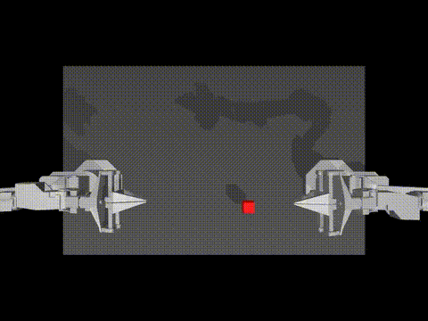

# Testing SARM + RA-BC on ALOHA Bimanual Manipulation

> **TL;DR:** We applied Stage-Aware Reward Models (SARM) and Reward-Aligned Behaviour Cloning (RA-BC) to the ALOHA cube transfer task using two different policies — ACT and DiffusionPolicy. With just 50 expert demos and no environment reward, RA-BC gave DiffusionPolicy a **3× boost** (8% → 24%) while ACT reached **68% success** on its own. Here's what we learned.

**Reference paper:** [Stage-Aware Reward Modeling (arXiv 2509.25358)](https://arxiv.org/html/2509.25358)
**Code:** [github.com/Dimios45/packsarm](https://github.com/Dimios45/packsarm)

---

## What's the Task?

**AlohaTransferCube-v0** — a simulated bimanual robot picks up a cube with its right arm and hands it to the left arm.

Here's an eval rollout — ACT + RA-BC at 80K steps:

| Property | Value |
|----------|-------|
| Robot | ALOHA (2 × 6-DOF arms, 14-DOF total) |
| Demos | 50 human expert episodes |
| Observations | RGB cameras + joint states |
| Success | Cube held in left gripper at episode end |

It's a hard task — the robot has to coordinate both arms to pick, lift, and transfer a small cube. With only 50 demos and no reward signal, learning a good policy is tough.

---

## The Idea: Score Every Frame, Train on the Best Ones

Standard behaviour cloning treats every frame in a demo equally. But not all frames are equally useful — some show the robot making real progress (grasping, lifting), while others are just idle or transitioning.

**SARM** (Stage-Aware Reward Model) learns to score each frame by how much task progress it represents, from 0 (start) to 1 (done). We trained it on our 50 demos with GPT-4V labeling 5 subtask stages: approach, grasp, lift, transfer, release.

*SARM's sparse head produces a smooth progress curve tracking ground truth.*

*The dense head segments the episode into 5 clear stages.*

**RA-BC** (Reward-Aligned Behaviour Cloning) then uses these scores to weight training samples. Frames where the robot is making progress get full weight. Stagnant or regressing frames get downweighted. The policy learns from a quality-filtered view of the dataset.

The key formula is simple:
- Compute a progress delta: how much did SARM's score increase over the next Δ frames?
- If the delta is above a threshold κ, give that frame full weight
- Otherwise, smoothly ramp the weight down

---

## What We Tried

We tested RA-BC with two very different policy architectures:

**ACT** (Action Chunking Transformer) — predicts 100-step action chunks. Good at smooth, coordinated bimanual motion. This is the stronger baseline for this task.

**DiffusionPolicy** — uses a denoising diffusion process to generate 8-step action chunks. More sensitive to data quality since it sees shorter windows.

Both used ImageNet-pretrained ResNet18 vision backbones and trained on the same 50 demos.

---

## Results

### DiffusionPolicy: RA-BC Gives a 3× Boost

| Config | Steps | Success Rate |
|--------|-------|-------------|
| Vanilla DP | 10K | 8% |
| **RA-BC (dense, κ=0.241)** | **10K** | **24%** |

DiffusionPolicy struggles with only 50 demos — 8% baseline. But RA-BC's frame weighting tripled performance to 24%. Because DP uses short 8-step action chunks and trains for fewer steps, every bit of data quality signal matters. RA-BC gives it exactly that.

We also ran a two-stage fine-tuning sweep that pushed the best checkpoint to 20% at 14K steps:

### ACT: Already Strong, RA-BC Doesn't Hurt

| Config | Steps | Success Rate |
|--------|-------|-------------|
| Vanilla ACT | 80K | **68%** |
| RA-BC (κ=0.01) | 80K | 62% |

ACT reaches 68% on its own — impressive for a bimanual task from 50 demos. RA-BC trails by 6pp here, which makes sense: ACT's 100-step chunks already capture long coherent segments, and after 80K steps of training it's thoroughly learned the dataset. There's less room for RA-BC to help.

At 20K steps the picture is different — all variants are within noise (~32±2%), showing RA-BC doesn't hurt even when it can't help much.

*ACT + RA-BC converges steadily, passing 40% at 25K steps.*

### Kappa Matters a Lot

The threshold κ controls how aggressively RA-BC filters frames. Getting it wrong is costly — auto-computed κ=0.241 threw away half the training data and cost 16pp vs the paper's κ=0.01 which lets 95% of frames through. With a small, uniform-quality dataset, you want gentle filtering.

---

## Why This is Interesting

The results tell a clear story about when RA-BC helps and when it doesn't:

**RA-BC shines when the policy needs help.** DiffusionPolicy with its short action chunks and limited training budget benefited enormously from quality-weighted training. The 3× improvement on uniform expert data is notable — RA-BC found useful signal even when all demos were competent.

**Strong policies on clean data need it less.** ACT's long action chunks and extended training mean it already learns to self-correct. On 50 uniform expert demos, there's not much quality variation for RA-BC to exploit.

**The real promise is mixed-quality data.** Our 50 demos are all competent — every episode succeeds. RA-BC is designed for datasets where some demos hesitate, backtrack, or fail partially. Real-world teleoperation data looks like this. With genuine quality variation, the progress deltas become much more discriminative and RA-BC's filtering signal gets stronger.

| Factor | Our 50-demo dataset | Real-world data |
|--------|-------------------|-----------------------------|
| Demo quality | Uniform expert | Mixed (novice → expert) |
| RA-BC signal | Weak | Strong |
| Expected gain | Modest (but still 3× for DP) | Substantial |

---

## Key Takeaways

1. **RA-BC works even on uniform data** — 3× lift for DiffusionPolicy shows the progress signal is real
2. **Use κ=0.01** — aggressive filtering starves the model when data is limited
3. **ACT is the stronger architecture for bimanual tasks** — action chunking and stable training make it reliable
4. **RA-BC's biggest gains will come with messier, more realistic data** — the method is built for quality filtering, which needs quality variation

---

*February 2026*
