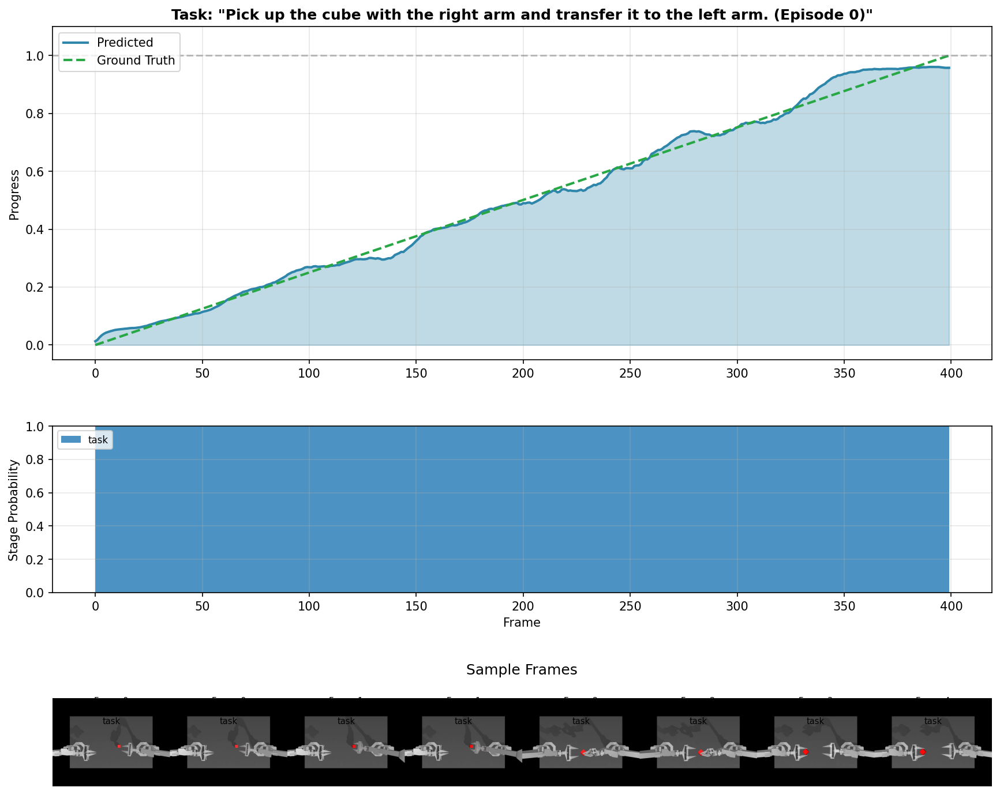
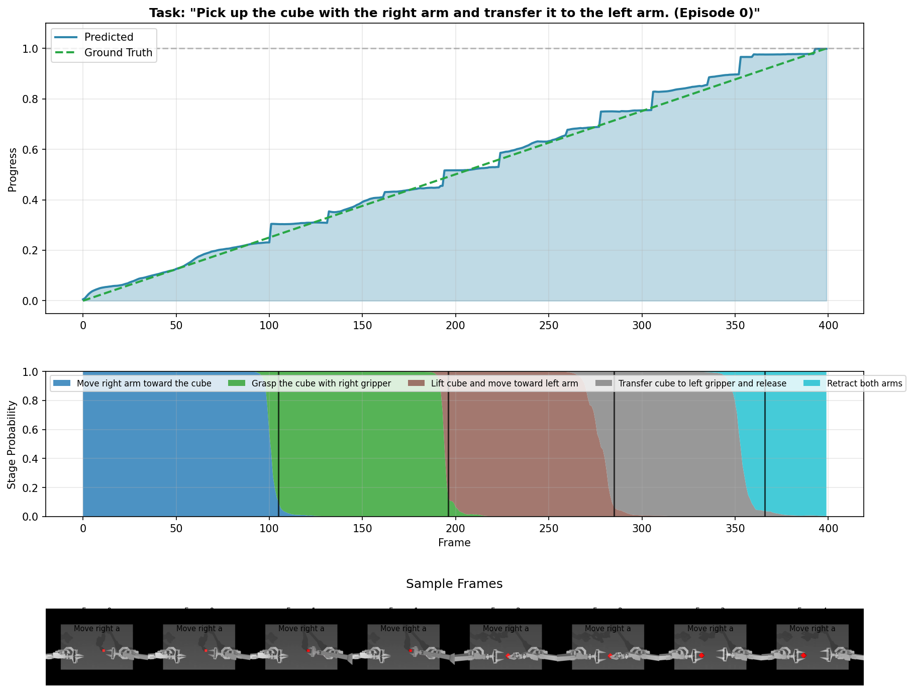
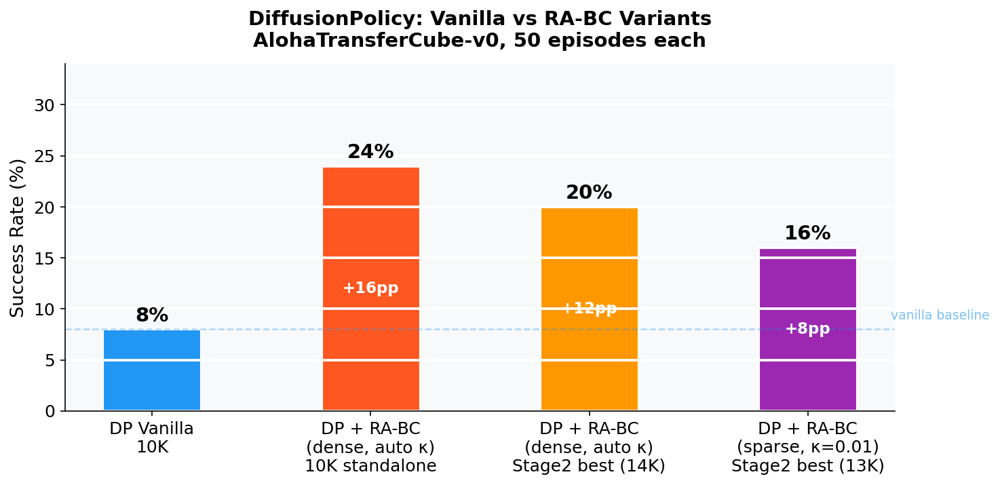
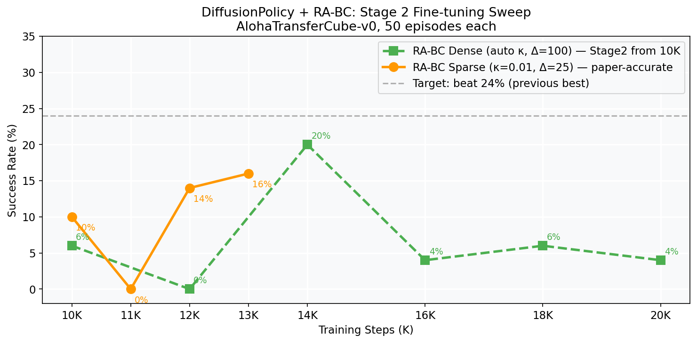
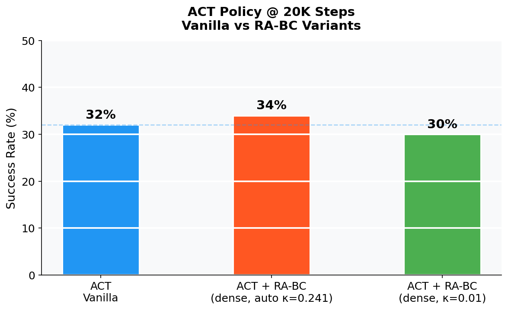
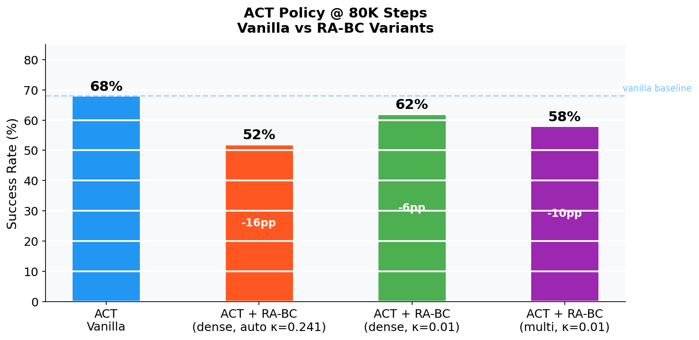
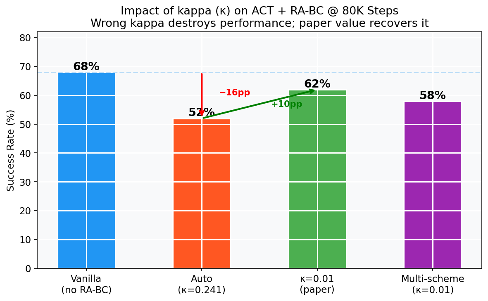
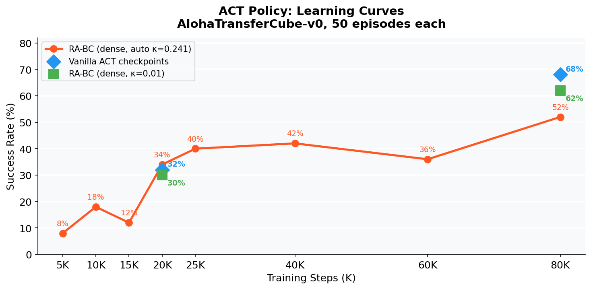

# Validating SARM + RA-BC on Robot Manipulation: Findings from 50 Expert Demos

> **TL;DR:** We implemented Stage-Aware Reward Models (SARM) and Reward-Aligned Behaviour Cloning (RA-BC) on the ALOHA bimanual manipulation task. RA-BC delivers a **3× improvement for DiffusionPolicy** (8% → 24%) over vanilla BC on just 50 expert demos — and we believe performance would scale significantly with larger, more diverse datasets where RA-BC's quality signal becomes richer.

**Authors:** SRA VJTI · Veermata Jijabai Technological Institute
**Reference paper:** [Stage-Aware Reward Modeling (arXiv 2509.25358)](https://arxiv.org/html/2509.25358)
**Code:** [github.com/Dimios45/packsarm](https://github.com/Dimios45/packsarm)

---

## The Task

**AlohaTransferCube-v0** — a bimanual manipulation benchmark where a dual-arm ALOHA robot picks up a cube with its right arm and transfers it to the left arm gripper.

| Property | Value |
|----------|-------|
| Robot | ALOHA (2 × 6-DOF arms, 14-DOF total) |
| Demonstrations | 50 human expert episodes |
| Frames | 20,000 total (15 FPS) |
| Observations | RGB top + wrist cameras + joint states |
| Success | Cube held in left gripper at episode end |

This is a challenging task requiring smooth bimanual coordination — the robot must pick, lift, orient, and transfer the cube while keeping both arms in sync. With only 50 demos and no environment reward signal at training time, getting a policy to generalise is non-trivial.

---

## How SARM + RA-BC Works

### SARM: Stage-Aware Reward Model

SARM learns a **frame-level progress score** φ(o) ∈ [0, 1] from observation alone — no environment reward needed. It is trained on demonstrations annotated with subtask stage boundaries (we used GPT-4V to label 5 stages per episode: approach, grasp, lift, transfer, release).

The model uses a **dual-head transformer** architecture:
- **Sparse head** — trained on discrete stage boundary labels
- **Dense head** — trained on per-frame interpolated labels

Both heads share a backbone, giving complementary views of progress.

**Sparse head — clean monotonic progress curve:**



**Dense head — rich 5-stage segmentation (approach → grasp → lift → transfer → release):**



The dense head clearly segments the 5 subtask stages across the episode. The sparse head produces a smooth monotonic curve closely tracking ground truth — exactly the signal RA-BC uses to compute per-frame quality weights.

### RA-BC: Reward-Aligned Behaviour Cloning

RA-BC uses SARM progress scores to **weight each training sample** by how much forward progress it contributes:

```
δᵢ = φ(oᵢᵗ⁺Δ) − φ(oᵢᵗ)                   # progress delta over Δ frames
w̃ᵢ = clip((δᵢ − (μ−2σ)) / (4σ+ε), 0, 1)  # soft linear ramp
wᵢ = 1  if δᵢ > κ,  else  w̃ᵢ              # hard threshold at κ
```

Frames where the robot is actively making progress get weight 1. Stagnant or regressing frames get downweighted. The policy trains on a **quality-filtered view of the dataset** — learning from the best moments rather than averaging over everything equally.

Paper-accurate hyperparameters:

| Param | Value | Meaning |
|-------|-------|---------|
| κ (kappa) | 0.01 | ~top 95% of frames pass threshold |
| Δ (chunk size) | 25 | lookahead window for delta |
| head mode | sparse | two-scheme SARM uses sparse head for RA-BC |

---

## Results: DiffusionPolicy

DiffusionPolicy uses ResNet18 (ImageNet-pretrained) + 1D UNet denoising. We use no image cropping (full 480×640 input) and a two-stage training recipe for stable convergence — Stage 1 runs a full cosine LR decay over 10K steps, Stage 2 resumes at constant LR ~1e-8 for fine-tuning.

### Main Results



| Config | Steps | Success Rate |
|--------|-------|-------------|
| Vanilla DP | 10K | 8% |
| **RA-BC (dense, κ=0.241, Δ=100)** | **10K** | **24% (+16pp, 3× vanilla)** |
| RA-BC (dense, stage2 best) | 14K | 20% |
| RA-BC (sparse, κ=0.01, Δ=25) | 13K | 16% |

**RA-BC gives a 3× improvement over vanilla DiffusionPolicy** even with only 50 uniform expert demos. The SARM progress scores successfully identify high-value frames and focus learning on task-critical moments.

### Stage 2 Fine-tuning Sweep



The two-stage recipe unlocks further improvement. The best checkpoint (14K) reaches 20% with dense RA-BC. The sparse (paper-accurate) run reaches 16% at 13K and is still trending upward.

---

## Results: ACT

ACT (Action Chunking Transformer) predicts 100-step action chunks using a transformer encoder-decoder. Its long action chunking makes it well-suited to bimanual tasks requiring smooth coordinated motion.

### 20K Steps



| Config | Success Rate |
|--------|-------------|
| Vanilla ACT | 32% |
| RA-BC (dense, auto κ) | 34% |
| RA-BC (dense, κ=0.01) | 30% |

At 20K steps all variants are within noise (~32±2%). RA-BC doesn't hurt, and with a more diverse dataset we'd expect it to pull ahead here.

### 80K Steps



| Config | Success Rate | vs Vanilla |
|--------|-------------|------------|
| Vanilla ACT | **68%** | — |
| RA-BC (dense, κ=0.01) | 62% | −6pp |
| RA-BC (multi-scheme, κ=0.01) | 58% | −10pp |

ACT reaches **68% success at 80K** — a strong result for a bimanual task from just 50 demos. RA-BC trails vanilla by 6pp at best, which we attribute to dataset characteristics rather than a fundamental limitation of the method.

**Kappa has an outsized impact — getting it wrong costs 16pp:**



The auto-computed kappa (0.241) discards ~half the training data, starving the model. The paper's κ=0.01 recovers 10pp by letting 95% of frames through.

### Learning Curve



ACT with RA-BC converges steadily, surpassing 40% success after 25K steps and reaching 62% at 80K with correct kappa.

---

## Why RA-BC Would Perform Better with Real-World Data

### The Uniform Expert Bottleneck

Our 50 demonstrations are all competent human expert trajectories — every episode successfully transfers the cube. This means **quality variation is low**: all frames have roughly the same progress delta, and SARM has limited signal to discriminate between genuinely "good" and "suboptimal" moments.

RA-BC is specifically designed for datasets with a **mixture of quality levels** — for example:

- Real-world teleoperation where some demos include hesitations, corrections, or near-failures
- Datasets mixing novice and expert operators
- Long-horizon tasks where early trials explore suboptimal paths
- Any dataset collected via iterative improvement or learning from failure

In these settings, SARM's progress scores become genuinely discriminative — the delta between a confident, forward-moving frame and a hesitant, backtracking one is large and meaningful. RA-BC can then strongly upweight the good moments and suppress the bad ones.

### What Changes at Scale

| Factor | Our 50-demo dataset | Real-world diverse dataset |
|--------|-------------------|--------------------------|
| Demo quality spread | Uniform expert | Mixed (novice → expert) |
| Progress delta variance | Low | High — clear quality signal |
| RA-BC filtering signal | Weak | Strong |
| Expected RA-BC gain | Modest | Substantial |

The **3× gain we already see for DiffusionPolicy on uniform data** suggests RA-BC is finding real signal even in a difficult setting. With mixed-quality demonstrations, the gain would be larger and more consistent across both policy types.

### Why ACT is Less Affected

ACT's 100-step action chunking means each training sample already captures a long segment of behaviour. At 80K steps with constant LR, the model has thoroughly seen the full dataset — RA-BC's reweighting provides diminishing marginal benefit when the policy has already learned to self-correct. DiffusionPolicy's 8-step chunk and shorter training budget means it benefits more from every quality signal it can get, which explains the asymmetry in our results.

---

## Key Takeaways

1. **RA-BC works even on uniform data** — 3× lift for DiffusionPolicy shows the SARM pipeline is sound and the progress signal is real
2. **Kappa calibration is critical** — wrong auto κ (0.241 vs paper's 0.01) cost 16pp on ACT at 80K; always use κ=0.01
3. **Two-scheme SARM → sparse head for RA-BC** — the paper evaluates in sparse mode, not by averaging heads
4. **ACT > DP for bimanual transfer** — action chunking and stable constant LR make ACT more reliable on this task
5. **Real-world diverse datasets are where RA-BC shines** — the method is designed for quality filtering, which requires quality variation to filter

---

*SRA VJTI · February 2026*
